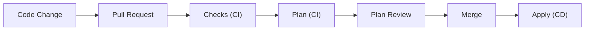

## Overview

This repository provisions and manages self hosted Proxmox server with a full, highly available Kubernetes cluster running on top of it, and AWS cloud instance with possible future expansion to other cloud providers.
Provisioned infrastructure is not split into typical environments like dev, test, prod. Instead it treats home and different cloud providers as separate environments.

This repository currently does not manage the very base layer of my home environment which includes Proxmox, TrueNAS, OPNsense and other network devices and instead focuses mainly on the applications and services running on top of it. This might change eventually.

Infrastructure is managed with Terraform while configuration is handled by Ansible.

## Architecture

## Workflow



## Repository structure

```
.
├── ansible               # Contains Ansible configuration, playbooks, roles and inventory.
│   ├── inventories       # Ansible inventory split into separate environments with their own vars.
│   │   ├── aws
│   │   └── home
│   ├── playbooks         # Ansible playbooks. Mostly used to call reusable roles.
│   └── roles             # Reusable Ansible roles.
├── dependencies          # Contains Ansible dependencies like Kubespray.
│   └── kubespray         # Kubespray *git submodule* with *pinned tag*.
├── scripts
│   └── ansible_setup.sh
└── terraform             # Contains Terraform environments and modules.
    ├── environments      # Separate Terraform environments per cloud provider.
    │   ├── aws
    │   └── home
    ├── modules           # Reusable Terraform modules separated by environment.
    │   ├── aws
    │   └── proxmox
    └── README.md         # The file you're reading.
```

## Prerequisites

This project requires a local, self hosted GitHub runner for interacting with a self hosted Proxmox server.

### Tools and versions

| Name        | Version |
| ---         | ---     |
| Terraform   | 1.15.8  |
| Ansible     | 11.13.0 |
| Kubespray   | 2.31.0  |
| Proxmox BPG | 0.110.0 |
| Python      | 3.12    |

### Accounts, credentials, permissions

SSH access with sudo for Ansible.

Proxmox API token for Terraform BPG provider.

AWS Access Key for Terraform AWS provider.

### Environment variables and secrets

Repository secrets:

ANSIBLE_SSH_PRIVATE_KEY
ANSIBLE_VAULT_PASSWORD

PROXMOX_VE_API_TOKEN
PROXMOX_VE_ENDPOINT
PROXMOX_VE_INSECURE

AWS_ACCESS_KEY_ID
AWS_SECRET_ACCESS_KEY

## Getting started

## State management

**Location** - Currently Terraform state is kept on Github runner's filesystem. This is not ideal due to lack of state locking mechanism which makes it impossible to safely make changes to infrastructure from multiple machines. Because of this limitation **the only supported way of making changes to infrastructure is through the GitHub Actions workflow**. This is something that could not be resolved at the time of creating this project due to resource constraints and will be addressed in the future.

**Separation** - Terraform state is separated by major system or group of apps. This way there is no risk of changes made, for example to a Minecraft server affecting the Kubernetes cluster. This approach ads another layer of stability and security to the environment.

**Backups** - State files are backed up with a simple cron job to a mounted SMB share once a day.

