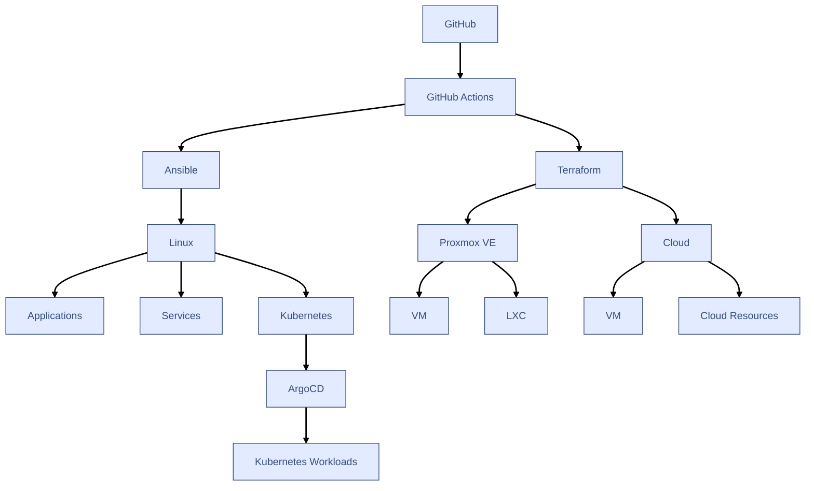
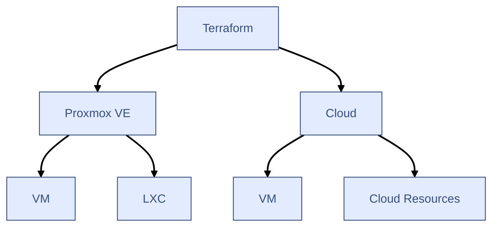
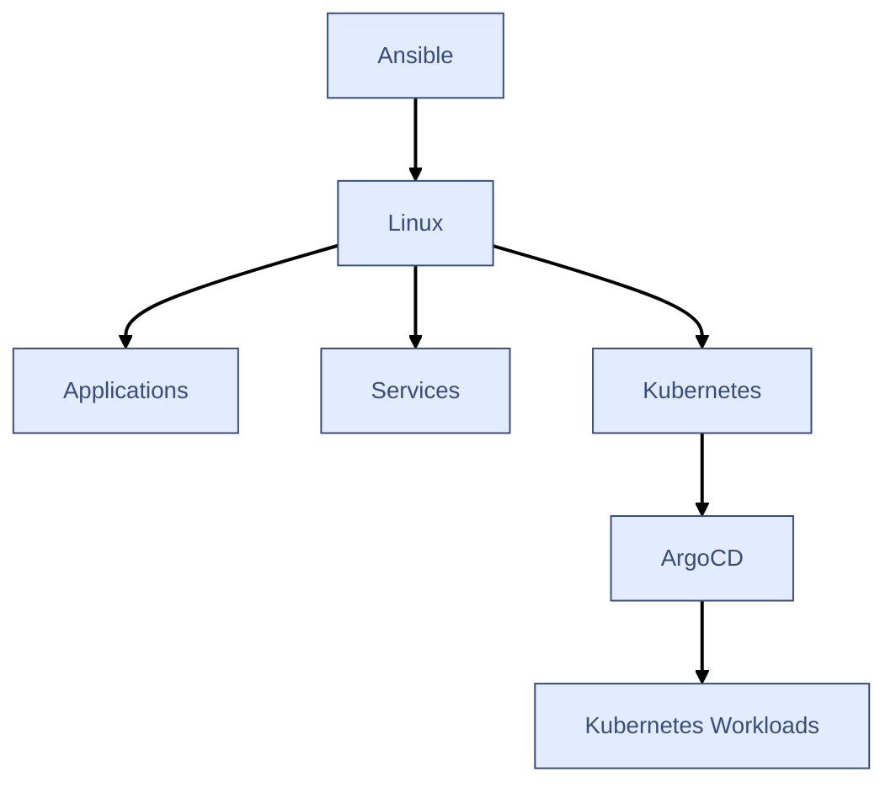
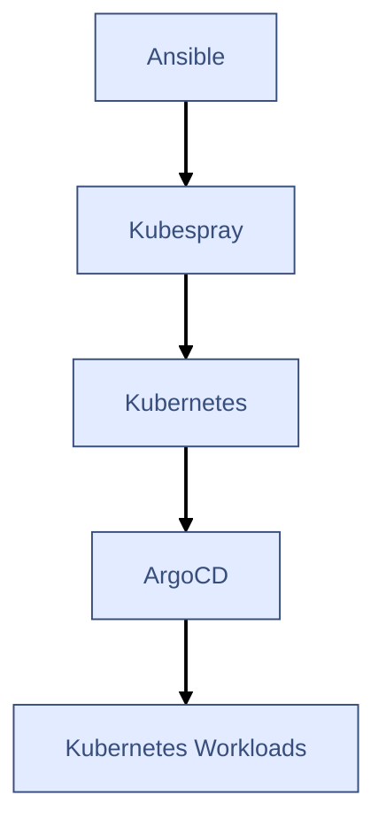
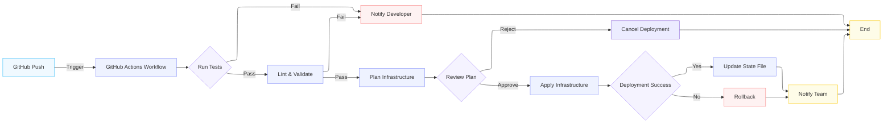

## Overview

Infrastructure as code project for provisioning and management of personal environments on Proxmox VE and commercial cloud platforms.

This repository provisions and manages resources on a self hosted Proxmox VE server and AWS cloud platform. Main goals of this project are modularity, reusability and reproducibility while keeping the code conscise and useful without it becoming a future maintenance burden.

This project is built around the concept of separate environments but not in a typical, corporate way. Instead of creating artificial dev / test / prod environments I made a decision to instead treat home server and different cloud providers as separate environments.

This repository currently does not manage the very base layer of my home environment which includes Proxmox VE, TrueNAS, OPNsense and assorted network devices and instead focuses mainly on the applications and services running on top of this estabilished base layer.

Main building blocks of this projects are:
- Terraform - Used for infrastructure provisioning which includes Proxmox VM, LXC and associated with them virtual devices and configuration, AWS resources like VPC, Security Group and EC2 instances.
- Ansible - Used for operating system, kubernetes and application installation and configuration.
- GitHub Actions as the CI/CD tool. The glue that holds all moving parts together.

Additionaly Kubernetes application provisioning is done via ArgoCD in its own GitOps repository: **REPO LINK**.

## Architecture



#### Infrastructure provisioning



Terraform is used for provisioning and management of infrastructure on top of Proxmox VE and cloud platforms.
It's responsible for infrastructure resources such as:
- Virtual machines
- Linux Containers
- VPCs
- Security Groups
- IAM

#### Configuration management



Ansible is responsible for configuration of the provisioned infrastructure. It manages things like:
- Kubernetes cluster deployment
- SSH key management
- User management
- System configuration
- Package installation and configuration

#### Kubernetes



Kubernetes cluster deployment is done via Kubespray on top of Proxmox VE provisioned virtual machines. Kubernetes workloads are deployed and managed through GitOps using ArgoCD: **REPO LINK**.

## Repository structure

```
.
├── ansible               # Contains Ansible configuration, playbooks, roles and inventory.
│   ├── inventories       # Ansible inventory split into separate environments with their own vars.
│   │   ├── aws
│   │   └── home
│   ├── playbooks         # Ansible playbooks. Mostly used to call reusable roles.
│   └── roles             # Reusable Ansible roles.
├── dependencies          # Contains Ansible dependencies like Kubespray.
│   └── kubespray         # Kubespray *git submodule* with *pinned tag*.
├── scripts
│   └── ansible_setup.sh
└── terraform             # Contains Terraform environments and modules.
    ├── environments      # Separate Terraform environments per cloud provider.
    │   ├── aws
    │   └── home
    ├── modules           # Reusable Terraform modules separated by environment.
    │   ├── aws
    │   └── proxmox
    └── README.md
```

## CI/CD workflow



CI/CD pipeline is built with GitHub Actions. Actions related to Home environment run on a local, self hosted GitHub Actions runner inside of a Linux container (LXC) while Cloud platform related actions run on a temporary GitHub hosted runner. **This keeps network access rules and credentials separate between environments** to minimize attack surface. 

GitHub Actions are designed to be **modular and reusable**. Every major application group or system has it's own Action that runs on pull requests that touch specific repository paths and triggers reusable Action with trigger type workflow_call that executes appropriate tasks.

All workflows use **concurency controls** to prevent running conflicting operations simultaneously.

##### Terraform pull requests

Workflow steps:
1. terraform fmt -check
2. terraform init
3. terraform validate
4. terraform plan (Posted as a comment in the pull request)
5. Merge
6. terraform apply

##### Ansible pull requests

Workflow steps:
1. SSH connectivity check with timeout
2. Ansible syntax check
3. Ansible playbook check and diff (Posted as comment in the pull request)
4. Merge
5. Ansible apply

## Secrets and security considerations

- No secrets are stored in plaintext inside of the repository. 
- Credentials required by GitHub Actions are kept as repository secrets and are injected at runtime. 
- Any temporary files that could contain potentially sensitive information are created in runner_temp directory and destroyed after job completion.
- Ansible Vault is used to store encrypted Ansible secrets.
- Local GitHub Actions runner runs in its own isolated container.
- Infrastructure changes are reviewed through pull requests.
- Terraform plans are created before applying changes.
- Ansible check mode is used to preview changes.
- Terraform destroy is kept as a separate workflow.

Repository secrets:
```
ANSIBLE_SSH_PRIVATE_KEY
ANSIBLE_VAULT_PASSWORD

PROXMOX_VE_API_TOKEN
PROXMOX_VE_ENDPOINT
PROXMOX_VE_INSECURE

AWS_ACCESS_KEY_ID
AWS_SECRET_ACCESS_KEY
```

Local GitHub Actions runner secrets:
```
Ansible SSH key
```

## State management

**Location** - Currently Terraform state is kept on Github runner's filesystem. This is not ideal due to lack of state locking mechanism which makes it impossible to safely make changes to infrastructure from multiple machines. Because of this limitation **the only supported way of making changes to infrastructure is through the GitHub Actions workflow**. This is something that could not be resolved at the time of creating this project due to resource constraints and will be addressed in the future.

**Separation** - Terraform state is separated by major system or group of apps. This way there is no risk of changes made, for example to a Minecraft server affecting the Kubernetes cluster. This approach ads another layer of stability and security to the environment.

**Backups** - State files are backed up with a simple cron job to a mounted SMB share once a day.

## Project goals

This project is intended to demonstrate practical experience with:

Infrastructure as Code
Terraform
Proxmox VE
Ansible
Linux administration
Kubernetes
Kubespray
GitHub Actions
CI/CD
GitOps
Argo CD
Infrastructure automation
Configuration management
Reproducible infrastructure
Idempotence in automation

The architecture is designed to resemble production infrastructure practices while remaining manageable as a one person home project.

## Future improvements

- Moving state to a dedicated system with locking mechanism.
- Improved secret management.
- Additional environments.
- Improved, automated off-site backups.
- Enabling provisioning and configuration of the very base layer of home environment if possible (Proxmox VE, TrueNAS, OPNsense, Home Assistant OS, network devices).

### Tools and versions

| Name        | Version |
| ---         | ---     |
| Terraform   | 1.15.8  |
| Ansible     | 11.13.0 |
| Kubespray   | 2.31.0  |
| Proxmox BPG | 0.110.0 |
| Python      | 3.12    |